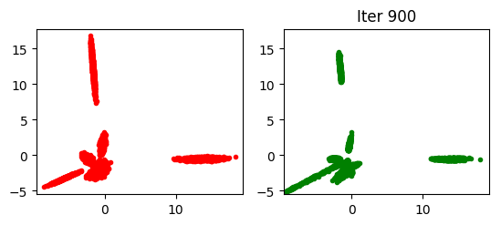
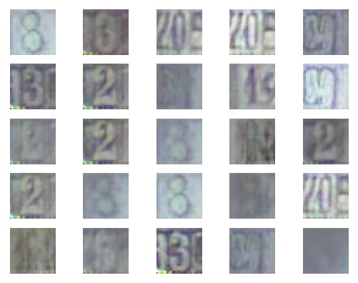
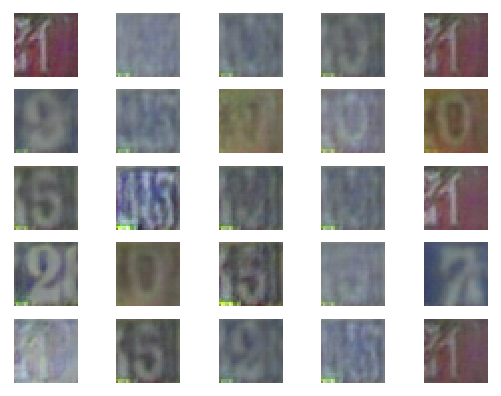
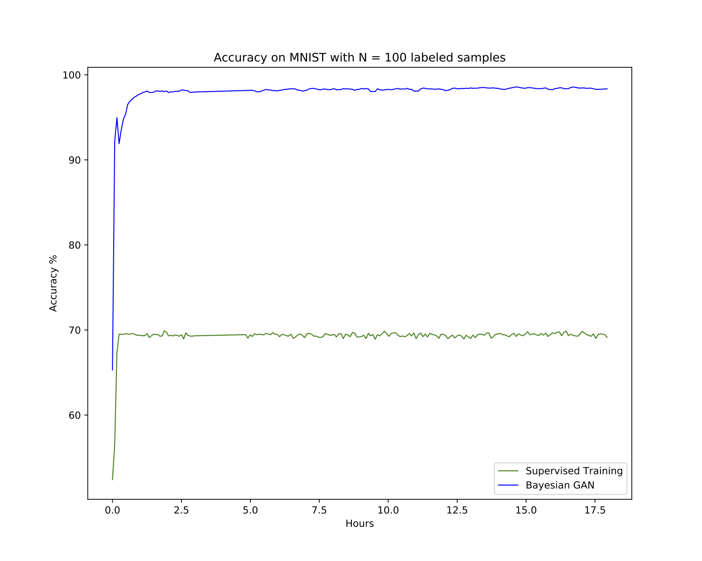

Bayesian Generative Adversarial Networks in Tensorflow
===============

This repository contains the Tensorflow implementation of the [Bayesian GAN](https://arxiv.org/abs/1705.09558) by Yunus Saatchi and Andrew Gordon Wilson.  This paper appears at NIPS 2017.

Please cite [our paper](https://arxiv.org/abs/1705.09558) if you find this code useful in your research. The bibliographic information for the paper is
```bibtex
@inproceedings{saatciwilson,
  title={Bayesian gan},
  author={Saatci, Yunus and Wilson, Andrew G},
  booktitle={Advances in neural information processing systems},
  pages={3622--3631},
  year={2017}
}
```


## Contents
1. [Introduction](#introduction)
2. [Dependencies](#dependencies)
3. [Training options](#training-options)
4. [Usage](#usage)
    1. [Installation](#installation)
    2. [Synthetic Data](#synthetic-data)
    3. [Examples: MNIST, CIFAR10, CelebA, SVHN](#mnist-cifar10-celeba-svhn)
    4. [Custom data](#custom-data)

## Introduction


In the Bayesian GAN we propose conditional posteriors for the generator and discriminator weights, and marginalize these posteriors through stochastic gradient Hamiltonian Monte Carlo.  Key properties of the Bayesian approach to GANs include (1) accurate predictions on semi-supervised learning problems; (2) minimal intervention for good performance; (3) a probabilistic formulation for inference in response to adversarial feedback; (4) avoidance of mode collapse; and (5) a representation of multiple complementary generative and discriminative models for data, forming a probabilistic ensemble. 

<p align="center">
    
</p>
    
We illustrate a multimodal posterior over the parameters of the generator.  Each setting of these parameters corresponds to a different generative hypothesis for the data.  We show here samples generated for two different settings of this weight vector, corresponding to different writing styles.  The Bayesian GAN retains this whole distribution over parameters.  By contrast, a standard GAN represents this whole distribution with a point estimate (analogous to a single maximum likelihood solution), missing potentially compelling explanations for the data.  

## Dependencies
This code has the following dependencies (version number crucial):

- python 2.7
- tensorflow==1.0.0

To install tensorflow 1.0.0 on linux please follow instructions at https://www.tensorflow.org/versions/r1.0/install/.

- scikit-learn==0.17.1

You can install scikit-learn 0.17.1 with the following command
```
pip install scikit-learn==0.17.1
```

Alternatively, you can create a conda environment and set it up using the provided environment.yml file, as such:
```
conda env create -f environment.yml -n bgan
```
then load the environment using
```
source activate bgan
```

## Usage

### Installation

1. Install the required dependencies
2. Clone this repository

### Synthetic Data 

To run the synthetic experiment from the paper you can use `bgan_synth` script. For example,
the following comand will train the Bayesian GAN (with D=100 and d=10) for 5000 iterations and store the results in `<results_path>`.
```
./bgan_synth.py --x_dim 100 --z_dim 10 --numz 10 --out <results_path>
```
To run the ML GAN for the same data run
```
./bgan_synth.py --x_dim 100 --z_dim 10 --numz 1 --out <results_path>
```

`bgan_synth` has `--save_weights`, `--out_dir`, `--z_dim`, `--numz`, `--wasserstein`, `--train_iter` and `--x_dim` parameters. 
`x_dim` contolls the dimensionality of the observed data (`x` in the paper). For description of 
other parameters please see [Training options](#training-options).

Once you run the above two commands you will see the output of each 100th iteration in <results_path>.
So, for example, the Bayesian GAN's output at the 900th iteration will look like:

<p align="center">
  
</p>

In contrast, the output of the standard GAN (corresponding to numz=1, which forces ML estimation) will look like:

<p align="center">
  
</p>

indicating clearly the tendency of mode collapse in the standard GAN which, for this synthetic example, is completely avoided by the Bayesian GAN.

To explore the sythetic experiment further, and to generate the Jensen-Shannon divergence plots, you can check out the notebook `synth.ipynb`.

## Unsupervised and Semi-Supervised Learning on benchmark datasets

### MNIST, CIFAR10, CelebA, SVHN

`bayesian_gan_hmc` script allows to train the model on standard and custom datasets. Below 
we describe the usage of this script.

#### Data preparation 
To reproduce the experiments on MNIST, CIFAR10, CelebA and SVHN datasets you need to prepare the
data and use a correct `--data_path`.
- for MNIST you don't need to prepare the data and can provide any `--data_path`;
- for CIFAR10 please download and extract the python version of the data from 
https://www.cs.toronto.edu/~kriz/cifar.html; then use the path to the directory containing `cifar-10-batches-py` as `--data_path`;
- for SVHN please download `train_32x32.mat` and `test_32x32.mat` files from http://ufldl.stanford.edu/housenumbers/ and use the directory containing these files as your `--data_path`;
- for CelebA you will need to have openCV installed. 
You can find the download links for the data at http://mmlab.ie.cuhk.edu.hk/projects/CelebA.html. 
You will need to create `celebA` folder with `Anno` and `img_align_celeba` subfolders. `Anno` must contain the 
`list_attr_celeba.txt` and `img_align_celeba` must contain the `.jpg` files. You will also need to crop
the images by running `datasets/crop_faces.py` script with `--data_path <path>` where `<path>` is the path
to the folder containing `celebA`. When training the model, you will need to use the same `<path>` for `--data_path`;

#### Unsupervised training

You can run unsupervised learning by running the `bayesian_gan_hmc` script without `--semi` parameter.
For example, use
```
./run_bgan.py --data_path <data_path> --dataset svhn --numz 10 --num_mcmc 2 --out_dir 
<results_path> --train_iter 75000 --save_samples --n_save 100
```
to train the model on the SVHN dataset. This command will run the method for 75000 iterations and save samples every 100 iterations. Here `<results_path>` must lead to the directory where the results will be stored. See [data preparation](#data-preparation) section for an explanation of how to set `<data_path>`. See [training options section](#training-options) for a description of other training options.

<p align="center">
    &nbsp;&nbsp;&nbsp;&nbsp; 
     &nbsp;&nbsp;&nbsp;&nbsp; 
     
</p>

#### Semi-supervised training

To run the semi-supervised experiments you can use the `run_bgan_semi.py` script, which offers many options including the following:

- `--out_dir`: path to the folder, where the outputs will be stored
- `--n_save`: samples and weights are saved every `n_save` iterations; default 100
- `--z_dim`: dimensionalit of `z` vector for generator; default 100
- `--data_path`: path to the data; see [data preparation](#data-preparation) for a detailed
discussion; this parameter is required
- `--dataset`: can be `mnist`, `cifar`, `svhn` or `celeb`; default `mnist`
- `--batch_size`: batch size for training; default 64
- `--prior_std`: std of the prior distribution over the weights; default 1
- `--num_gen`: same as J in the paper; number of samples of `z` to integrate it out for generators; default 1
- `--num_disc`: same as J_D in the paper; number of samples of `z` to integrate it out for discriminators; default 1
- `--num_mcmc`: same as M in the paper; number of MCMC NN weight samples per z; default 1
- `--lr`: learning rate used by the Adam optimizer; default 0.0002
- `--optimizer`: optimization method to be used: `adam` (tf.train.AdamOptimizer) or `sgd` (tf.train.MomentumOptimizer); default `adam`
- `--N`: number of labeled samples for semi-supervised learning
- `--train_iter`: number of training iterations; default 50000
- `--save_samples`: save generated samples during training
- `--save_weights`: save weights during training
- `--random_seed`: random seed; note that setting this seed does not lead to 100% reproducible
results if GPU is used

You can also run WGANs with `--wasserstein` or train an ensemble of `<num_dcgans>` DCGANs with `--ml_ensemble <num_dcgans>`. In particular you can train a DCGAN with `--ml`.

You can train the model in semi-supervised setting by running `bayesian_gan_hmc` with `--semi` option. Use `-N` parameter to set the number of labeled examples to train on. For example, use
```
./run_bgan_semi.py --data_path <data_path> --dataset cifar --num_gen 10 --num_mcmc 2
--out_dir <results_path> --train_iter 100000 --N 4000 --lr 0.0005
```
to train the model on CIFAR10 dataset with 4000 labeled examples. This command will train the model for 100000 iterations and store the outputs in `<results_path>` folder.

<p align="center">
    
</p>

To train the model on MNIST with 100 labeled examples you can use the following command.
```
./bayesian_gan_hmc.py --data_path <data_path>/ --dataset mnist --num_gen 10 --num_mcmc 2
--out_dir <results_path> --train_iter 100000 -N 100 --semi --lr 0.0005
```

<p align="center">
    
</p>


### Custom data

To train the model on a custom dataset you need to define a class with a specific interface. 
Suppose we want to train the model on the [digits](http://scikit-learn.org/stable/modules/generated/sklearn.datasets.load_digits.html) dataset. 
This datasets consists of 8x8 images of digits. Let's suppose that the data is stored in 
`x_tr.npy`, `y_tr.npy`, `x_te.npy` and `y_te.npy` files. We will assume that `x_tr.npy` and `x_te.npy` 
have shapes of the form `(?, 8, 8, 1)`. We can then define the class corresponding to this dataset in
`bgan_util.py` as follows.

```
class Digits:

    def __init__(self):
        self.imgs = np.load('x_tr.npy') 
        self.test_imgs = np.load('x_te.npy')
        self.labels = np.load('y_tr.npy')
        self.test_labels = np.load('y_te.npy')
        self.labels = one_hot_encoded(self.labels, 10)
        self.test_labels = one_hot_encoded(self.test_labels, 10) 
        self.x_dim = [8, 8, 1]
        self.num_classes = 10

    @staticmethod
    def get_batch(batch_size, x, y): 
        """Returns a batch from the given arrays.
        """
        idx = np.random.choice(range(x.shape[0]), size=(batch_size,), replace=False)
        return x[idx], y[idx]

    def next_batch(self, batch_size, class_id=None):
        return self.get_batch(batch_size, self.imgs, self.labels)

    def test_batch(self, batch_size):
        return self.get_batch(batch_size, self.test_imgs, self.test_labels)
```

The class must have `next_batch` and `test_batch`, and must have the `imgs`, `labels`, `test_imgs`, 
`test_labels`, `x_dim` and `num_classes` fields.


Now we can import the `Digits` class in `bayesian_gan_hmc.py`

```
from bgan_util import Digits
```

and add the following lines to  to the processing of `--dataset` parameter.

```
if args.dataset == "digits":
    dataset = Digits()
```

After this preparation is done, we can train the model with, for example,
```
./run_bgan_semi.py --data_path <any_path> --dataset digits --num_gen 10 --num_mcmc 2 
--out_dir <results path> --train_iter 100000 --save_samples
```

### Acknowledgements

We thank Pavel Izmailov and Ben Athiwaratkun for help with stress testing this code and creating the tutorial.
